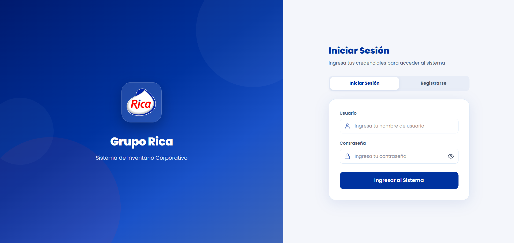
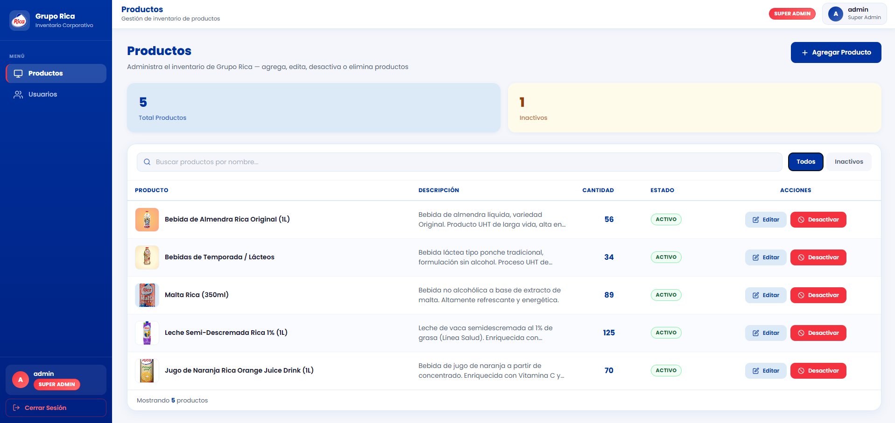
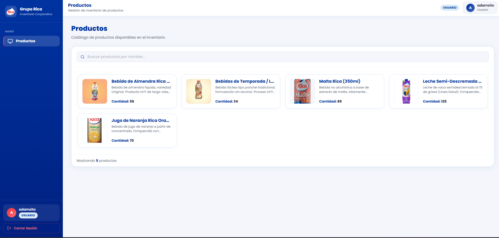
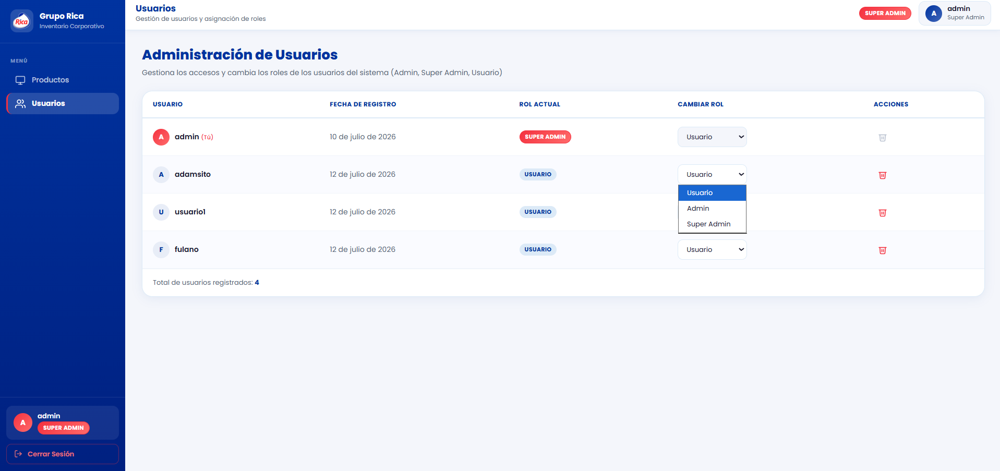

# Sistema de Inventario - Grupo Rica

Aplicación web para el control de abastecimiento y gestión de inventario de Grupo Rica, utilizando .NET Core para el backend y React con TypeScript en el frontend.

---

## Capturas de Pantalla

Aquí puedes ver la interfaz principal y el funcionamiento de la aplicación:

### Login


### Gestión de productos


### Vista de producto como usuario


### Gestion de usuarios como Super Admin


---

## Requisitos Previos

Antes de comenzar, asegúrate de tener instalado en tu equipo:
*   [.NET SDK 8.0 o superior](https://dotnet.microsoft.com/download)
*   [Node.js v18.0 o superior](https://nodejs.org/)
*   [SQL Server / LocalDB](https://learn.microsoft.com/sql/database-engine/configure-windows/sql-server-express-localdb)

---

## Configuración del Backend (.NET Core)

1. Abre una consola en la carpeta raíz del backend:
   ```bash
   cd pruebaRica
   ```

2. Configura tu cadena de conexión a la base de datos en el archivo `appsettings.json` (dentro de la propiedad `ConnectionStrings:DefaultConnection`). Por defecto se utiliza LocalDB:
   ```json
   "DefaultConnection": "aqui-pondras-el-nombre-de-tu-db-local\\mssqllocaldb;Database=RicaInventoryDb;Trusted_Connection=True;MultipleActiveResultSets=true"
   ```

3. Instala las herramientas de Entity Framework si aún no las tienes globales en tu equipo:
   ```bash
   dotnet tool install --global dotnet-ef
   ```

4. Aplica las migraciones para crear la base de datos y sus tablas automáticamente en tu SQL Server:
   ```bash
   dotnet ef database update --project DataAccess --startup-project pruebaRica
   ```

5. Inicia el servidor de la API:
   ```bash
   dotnet run
   ```
   *El servidor backend quedará escuchando por defecto en http://localhost:5058.*

---

## Configuración del Frontend (React + TypeScript)

1. Abre una consola en la carpeta raíz del frontend:
   ```bash
   cd frontend
   ```

2. Instala todos los paquetes y dependencias del proyecto:
   ```bash
   npm install
   ```

3. Crea un archivo llamado `.env` en la raíz de la carpeta `frontend` y agrega la URL de la API:
   ```env
   VITE_API_BASE_URL=http://localhost:5058
   ```

4. Levanta el servidor de desarrollo de React:
   ```bash
   npm run dev
   ```
   *Abre en tu navegador la dirección indicada en la consola (por defecto http://localhost:5173 o http://localhost:5174).*

---

## Credenciales de Acceso

La base de datos se inicializa con los siguientes usuarios de prueba:

*   **Super Administrador**:
    *   **Usuario**: `admin`
    *   **Contraseña**: `admin123`
*   **Usuario Estándar**:
    *   **Usuario**: `user`
    *   **Contraseña**: `user123`